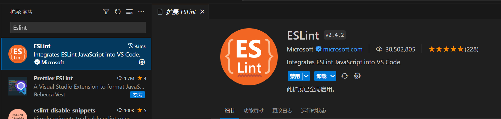
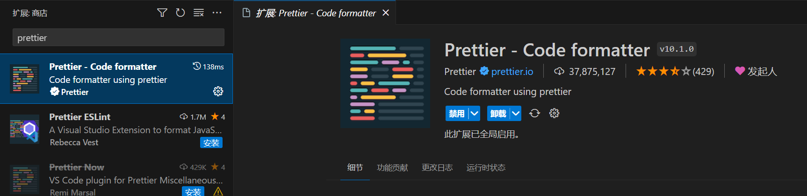
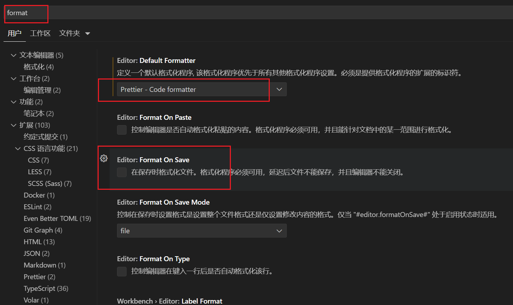
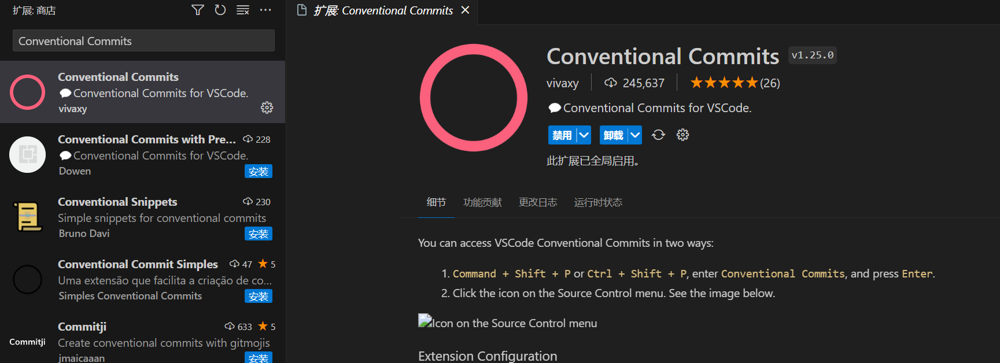
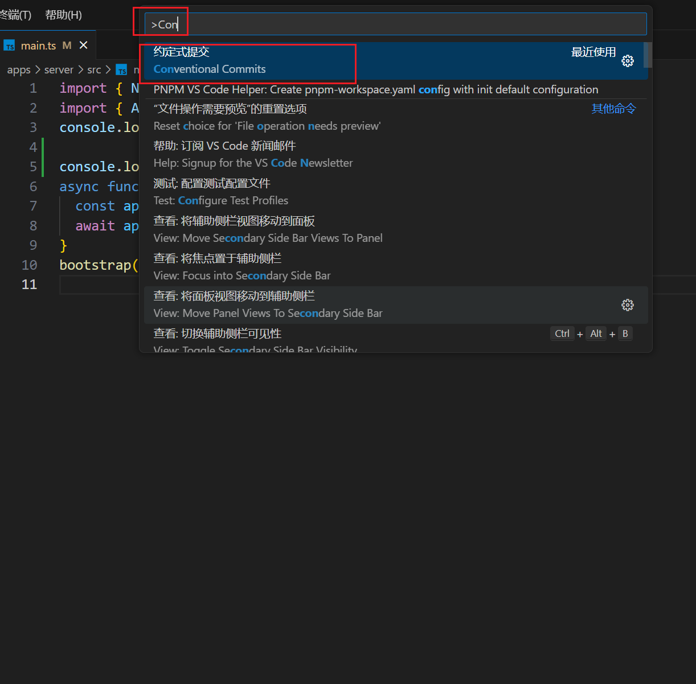
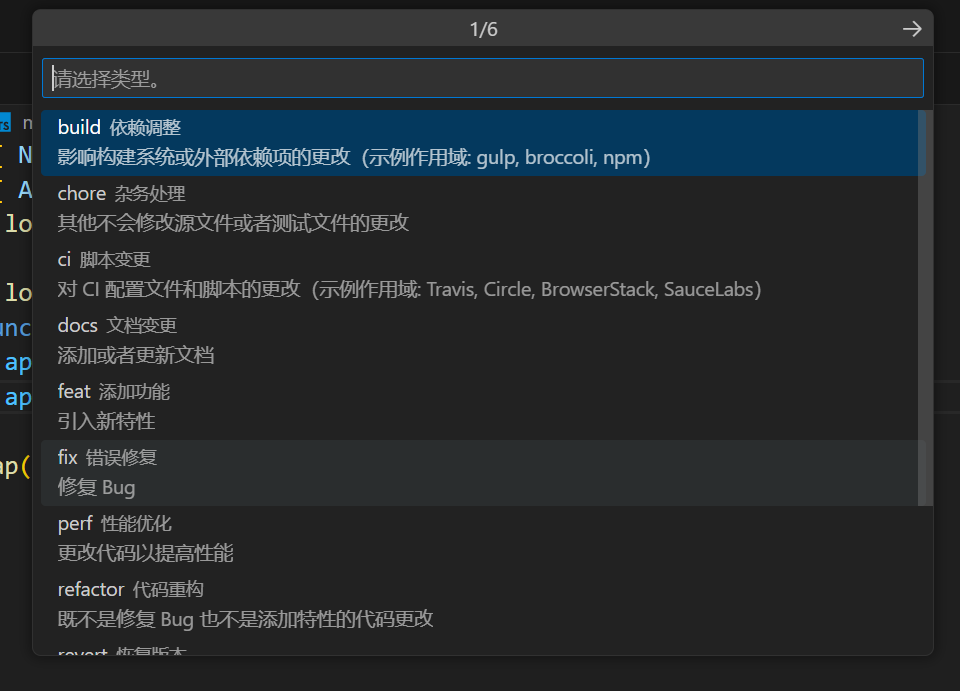
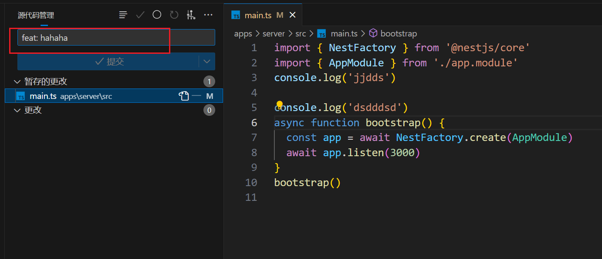

# 使用 pnpm workspace 和 turborepo 搭建 monorepo 仓库

最近刚学完 react、nestjs、monorepo 项目架构相关的东西，所以准备使用这一套东西搭建一个monorepo仓库练练手。

## 项目初始化

### 创建项目

首先创建项目根文件夹叫 `app-test`，接着进入到里面执行 `npm init` 初始化一个 `package.json` 文件，然后继续创建一个 `apps` 的文件夹，最后进入里面。

```bash
mkdir app-test
cd app-test
npm init
mkdir apps
cd apps
```

### 创建 nestjs 服务端项目

直接在 apps 目录下执行以下命令，创建一个 nestjs 项目。

```bash title="apps"
nest new server --skip-git --skip-install -p pnpm
```

`--skip-git` 不要初始化 git 仓库，等会要在最外层创建 git 仓库

`--skip-install` 不要自动下载依赖，等会要通过 pnpm 统一下载。

`-p pnpm` 指定使用的包管理器为 pnpm

nest 命令需全局安装 @nestjs/cli

```bash
pnpm i @nestjs/cli -g
```

### 创建 vite react 前端项目

继续在 apps 目录下执行以下命令，创建一个 vite 项目。

```bash title="apps"
pnpm create vite
```

项目名输入为 client，选择 react，选择 typescipt。

没有报错的话，这样前端项目也创建好了。

### 配置 pnpm 工作区

回到项目的根目录，创建`pnpm-workspace.yaml`，填入以下内容：

```yml title="pnpm-workspace.yaml"
packages:
  - 'apps/*'
```

这个文件的作用是告诉 pnpm 当前文件夹是一个 monorepo 项目，并且该项目有一个位于 apps 文件夹下的 workspace，也就是说这个文件夹下的子文件夹都是独立的项目。

### 安装 turbo

在项目根目录执行以下命令

```bash
pnpm i -w -D turbo
```

添加 turborepo 的配置文件 `turbo.json`

```json title="turbo.json"
{
  "$schema": "https://turborepo.com/schema.json",
  "ui": "stream",
  "tasks": {
    "build": {
      "dependsOn": ["^build"],
      "inputs": ["$TURBO_DEFAULT$", ".env*"],
      "outputs": ["dist/**", "artifacts/**"]
    },
    "lint": {},
    "dev": {
      "cache": false,
      "persistent": true
    }
  }
}
```

### 添加启动命令

在项目的根目录的 `package.json` 里面添加一个 `dev` 命令。

```json title="package.json"
{
  ...
  "scripts": {
    "dev": "turbo run dev",
  },
  ...
}
```

现在执行 `dev` 脚本，pnpm 会找到 apps 下的所有子项目的 package.json 的 `dev` 脚本执行，这样我们就可以一条命令启动多个项目了。

但是现在服务端的 package.json 里并没有 dev 命令，现在需要在里面加一下，内容和原来 nestjs 项目的开发命令`start:dev`一致即可。

```json title="apps/server/package.json"
{
  ...
  "scripts": {
    ...
    "start": "nest start",
    "dev": "nest start --watch",
    "start:dev": "nest start --watch",
    ...
  }
  ...
}
```

### 下载依赖启动项目

在项目的根目录下执行以下命令

```bash
pnpm i
pnpm dev
```

启动完成后，可以看到两个项目都启动了。

按照目前的配置，当改动 nestjs 项目的代码，nestjs 的热更新将会重新覆盖控制台内容，前面的内容就看不到了，开发体验将会很难受，所以接下来在 nest start 时加上 `--preserveWatchOutput` 即可解决这个问题。

```json title="apps/server/package.json"
{
  ...
  "scripts": {
    ...
    "dev": "nest start --watch --preserveWatchOutput",
    ...
  }
  ...
}
```

### 初始化 git 仓库

先添加 `.gitignore` 文件，填入以下内容：

```json title=".gitignore"
node_modules
dist
```

最后初始化一下

```bash
git init
git add .
git commit -m "project init"
```

## 工程化配置

monorepo 的一个优势点是，可以让我们在多个项目中，标准化一套代码 prettier、eslint、git hook 等配置，接下来就把这些全部配置好。

### 配置 eslint、prettier

当编码完成时，我们使用 eslint 按照一定的规则对代码进行代码质量和格式检查，检查通过后再提交代码。

eslint 也可以对代码进行一定的自动格式化，但这并不是 eslint 的侧重点，所以我们还会引入 prettier 来对我们的代码进行自动格式化以统一代码风格。

首先把 client 和 server 共同的 eslint、prettier 相关依赖抽离到根目录的 package.json，同时添加两条新的 script，虽然 vite 创建的 client 项目并没有 prettier，但等会我们自己加上一些配置。

删除以下文件中注释的语句

```json title="apps/client/package.json"
{
  // ...
  "devDependencies": {
    "@types/react": "^18.2.43",
    "@types/react-dom": "^18.2.17",
    // "@typescript-eslint/eslint-plugin": "^6.14.0",
    // "@typescript-eslint/parser": "^6.14.0",
    "@vitejs/plugin-react": "^4.2.1",
    // "eslint": "^8.55.0",
    "eslint-plugin-react-hooks": "^4.6.0",
    "eslint-plugin-react-refresh": "^0.4.5",
    // "typescript": "^5.2.2",
    "vite": "^5.0.8"
  }
}
```

```json title="apps/server/package.json"
{
  // ...
  "devDependencies": {
    "@nestjs/cli": "^10.0.0",
    "@nestjs/schematics": "^10.0.0",
    "@nestjs/testing": "^10.0.0",
    "@types/express": "^4.17.17",
    "@types/jest": "^29.5.2",
    "@types/node": "^20.3.1",
    "@types/supertest": "^2.0.12",
    // "@typescript-eslint/eslint-plugin": "^6.0.0",
    // "@typescript-eslint/parser": "^6.0.0",
    // "eslint": "^8.42.0",
    // "eslint-config-prettier": "^9.0.0",
    // "eslint-plugin-prettier": "^5.0.0",
    "jest": "^29.5.0",
    // "prettier": "^3.0.0",
    "source-map-support": "^0.5.21",
    "supertest": "^6.3.3",
    "ts-jest": "^29.1.0",
    "ts-loader": "^9.4.3",
    "ts-node": "^10.9.1",
    "tsconfig-paths": "^4.2.0"
    // "typescript": "^5.1.3"
  }
  // ...
}
```

然后在项目根目录加上

```json title="package.json"
{
  ...
  "scripts": {
    "lint": "turbo run lint",
    "format": "prettier --write \"**/*.{ts,tsx}\"",
    ...
  },
  "devDependencies": {
    "@typescript-eslint/eslint-plugin": "^6.14.0",
    "@typescript-eslint/parser": "^6.14.0",
    "eslint": "^8.55.0",
    "eslint-config-prettier": "^9.0.0",
    "eslint-plugin-prettier": "^5.0.1",
    "prettier": "^3.0.3",
    "typescript": "^5.2.2"
  }
}
```

重新安装一下

```shell
pnpm i
```

这样项目公用的依赖就可以抽离出来了安装在根目录的 `node_modules` 了。

format 命令将会使用 `.prettierrc` 文件的配置对根文件夹下的所有文件进行格式化，但现在还没有需要先创建一下。

```json title=".prettierrc"
{
  "semi": false,
  "singleQuote": true,
  "printWidth": 80,
  "tabWidth": 2,
  "trailingComma": "none",
  "arrowParens": "avoid",
  "endOfLine": "lf"
}
```

这是我个人喜欢的风格，可以[查阅链接](https://prettier.io/docs/en/options)了解 prettier 各项配置。

再添加一份 prettier 的忽略文件 `.prettierignore`

```json title=".prettierignore"
node_modules
dist
pnpm-lock.yaml
pnpm-workspace.yaml
```

还要把 `apps/server/.prettierrc` 文件删除掉，已经不需要这个了。

这时先安装两个插件，搜索 `eslint` 和 `prettier`。





现在重启一下 vscode。

直接打开 `apps/server/src/main.ts` 文件，会发现编辑器会有对应 `;` 的报错提示，因为我设置了 prettier 规则的"semi" 为 false，这个配置是让代码不需要`;`结尾，直接 Ctrl + S 保存一下，代码将被 prettier 自动格式化了。

因为接下来要先测试一下 lint 和 format 命令。所以先把自动格式化清除。



把 Format On Save 取消勾选即可。

现在先修改一下以下文件，把原来的--fix 去掉，有 --fix 执行 lint 会自动修复，我们现在要它报错。

```json title="apps/server/package.json"
{
  ...
  "script": {
    ...
    // "lint": "eslint \"{src,apps,libs,test}/**/*.ts\" --fix",
    "lint": "eslint \"{src,apps,libs,test}/**/*.ts\"",
  }
}
```

此时我们分别在 `apps/client/src/main.tsx` 和 `apps/server/src/main.ts` 代码里随便上添加一个`;`号，保存(此时不会自动修复了)然后执行 pnpm lint。

此时可以看到 client 那边没有任何错误提示，而 server 这边有，并且项目根目录下执行 pnpm lint 也只有 server 会报错。这是因为我前面说了 vite 创建的 client 项目并没有 prettier，所以现在需要在 eslint 的 extends 加入一个 prettier 的规则来使 prettier 的规则在 client 的 eslint 生效。

```js title="apps/client/.eslintrc.cjs"
module.exports = {
  root: true,
  parser: '@typescript-eslint/parser',
  env: { browser: true, es2020: true },
  extends: [
    'eslint:recommended',
    'plugin:@typescript-eslint/recommended',
    'plugin:react-hooks/recommended',
    'plugin:prettier/recommended' // 加入这句
  ],
  ignorePatterns: ['dist', '.eslintrc.cjs'],
  plugins: ['react-refresh'],
  rules: {
    'react-refresh/only-export-components': [
      'warn',
      { allowConstantExport: true }
    ]
  }
}
```

此时应该可以看到编辑器报错了，并且重新执行 `pnpm lint` 发现 client 的 lint 也不会通过。

现在可以执行 `pnpm format`，把全部文件格式化一遍。

```shell
pnpm format
```

### husk 管理 git hook

[husk文档](https://typicode.github.io/husky/)

如果仅有 eslint 和 prettier，那我们需要在代码提交前手动执行 prettier 和 eslint ，对代码进行格式化以及代码质量和格式检查，这时候可以使用 git hooks 功能自动在提交时进行检查，而 husky 工具可以创建管理仓库中的所有 git hooks。

在项目根目录安装 husky 包

```shell
pnpm i -w -D husky
```

然后通过 pnpx 执行 husky 命令启用 git hook

```shell
pnpx husky
```

我们在根目录 `package.json` 文件添加一个 prepare 脚本，这样其他人克隆该项目并安装依赖时会自动通过 husky 启动 git hook

```json title="package.json"
{
  ...
  "scripts": {
    "prepare": "husky",
    ...
  },
}
```

这个时候可以看到根目录多出了个 `.husky` 文件夹

### 添加 pre-commit hook

我们需要的第一个 git hook 是在提交 commit 之前，执行 eslint 工具对代码进行质量和格式检查，也就是在提交 commit 之前执行 package.json 中的 lint 脚本。

创建 `.husky/pre-commit` 文件，写入以下内容：

```bash title=".husky/pre-commit"
pnpm lint
```

我们再来验证一下是否生效，再在代码里随便加一个`;`号，然后提交一个 commit。

```shell
git add .
git commit -m "use git hook"
```

可以看到确实执行 package.json 中的 lint 脚本，然后输出了错误信息，并且中断了 git commit 过程。

删掉 `;` 号重新 add 并提交 commit，可以看到成功提交了。

### lint-staged 使用

[lint-staged文档](https://www.npmjs.com/package/lint-staged)

随着代码存储库的代码量增多，如果在每次提交代码时，我们都对全量代码执行格式化和检查，将会性能低下，我们希望提交代码时只对当前发生了代码变更的文件执行格式化和检查，那么我们就需要 lint-staged 工具。

```shell
pnpm i -w -D lint-staged
```

在两个子项目的 `package.json` 中加入 `lint-staged` 配置：

```json title="apps/client/package.json"
{
	...
	"lint-staged": {
		"*.ts": "eslint",
		"*.tsx": "eslint"
	},
  ...
}
```

```json title="apps/server/package.json"
{
  ...
  "lint-staged": {
    "*.ts": "eslint"
  },
  ...
}
```

`lint-staged` 的作用是仅对变更的文件执行相关操作，在这里就是执行 eslint 检查，这样就不需要执行原来的 `lint` 脚本了，所以最后需要修改一下 pre-commit 文件。

```bash title=".husky/pre-commit"
# pnpm lint
pnpm lint-staged
```

我们再来验证一下是否生效，再在代码里随便加一个`;`号，然后提交一个 commit。

```shell
git add .
git commit -m "lint-staged test"
```

此时可以看到提交中断了。

删掉 `;` 号重新 add 并提交 commit，可以看到成功提交了。

### 使用 commitlint 对提交消息检查

[commitlint文档](https://commitlint.js.org/#/)

如果还希望对 commit message 进行格式检查确保其基本符合 Angular 规范，这有利于根据 commit message 自动生成 changelog 和 release note，此时就需要用上 commitlint 工具。

在项目根目录下载

```shell
pnpm i -w -D @commitlint/cli @commitlint/config-conventional
```

添加 `.commitlintrc.json` 文件到根目录

```json title=".commitlintrc.json"
{
  "extends": ["@commitlint/config-conventional"]
}
```

创建 `.husky/commit-msg` 文件，写入以下内容：

```bash title=".husky/commit-msg"
pnpm --no -- commitlint --edit "$1"
```

它的作用是在我们提交 commit 或者修改 commit message 时对 commit message 进行相关校验，这样就可以确保我们的项目拥有一个统一的 commit message 风格。

接下来随便提交一下看看。

```shell
git add .
git commit -m "commitlint init"
```

此时可以看到消息不符合规范，commit 被中断了，那怎么符合规范呢，这时候试试一个符合规范的 message 。

```shell
git commit -m "feat: commitlint init"
```

这时候便提交成功了，对于这个 commit message 的规范，可以去看看 commitlint 的文档，而我推荐使用一个 vscode 插件进行提交，这样会有提示，搜索`Conventional Commits`。



以后需要提交代码时就可以输入 `ctrl` + `shift` + `P` 搜索 `Conventional Commits`





你可以看到对应的提交类型，按照你对文件的修改属于什么性质选择即可。



其实就是给你生成了对应的前缀，已方便后续管理提交历史。

本节的项目工程化配置就到这里结束，测试完成后可以把 prettier 的自动保存修复改回去了，这个还是挺好用的。

## 前后端共享子包

使用 monorepo 仓库构建前后端同构项目的一个好处是可以让前后端都共享一些通用包，里面可以是类型，工具函数，或者是项目的基础设施等。

### 创建子包

先创建一个 packages 文件夹，接下来在 packages 目录创建一个项目 utils

```tree
packages
├── utils
│   ├── src
│   │   └── index.ts
│   ├── package.json
│   ├── tsconfig.json
│   ├── tsconfig.lib.json
│   ├── tsconfig.node.json
│   └── tsup.config.ts
```

```ts title="packages/utils/src/index.ts"
export function testFun() {
  console.log('test')
}
```

```json title="packages/utils/package.json"
{
  "name": "@test/utils",
  "version": "0.0.0",
  "private": true,
  "types": "dist/index.d.ts",
  "main": "dist/index.js",
  "module": "dist/index.mjs",
  "scripts": {
    "dev": "tsup --watch",
    "build": "tsup"
  },
  "devDependencies": {
    "@types/node": "^22.10.7",
    "tsup": "^8.5.0"
  }
}
```

```json title="packages/utils/tsconfig.json"
{
  "files": [],
  "references": [
    { "path": "./tsconfig.lib.json" },
    { "path": "./tsconfig.node.json" }
  ]
}
```

```json title="packages/utils/tsconfig.lib.json"
{
  "$schema": "https://json.schemastore.org/tsconfig",
  "compilerOptions": {
    "composite": false,
    "declaration": true,
    "declarationMap": true,
    "esModuleInterop": true,
    "forceConsistentCasingInFileNames": true,
    "inlineSources": false,
    "isolatedModules": true,
    "target": "esnext",
    "module": "esnext",
    "moduleResolution": "bundler",
    "noUnusedLocals": false,
    "noUnusedParameters": false,
    "preserveWatchOutput": true,
    "skipLibCheck": true,
    "strict": true,
    "sourceMap": true,
    "outDir": "dist",
    "rootDir": "src"
  },
  "include": ["src"],
  "exclude": ["node_modules", "dist"]
}
```

```json title="packages/utils/tsconfig.node.json"
{
  "$schema": "https://json.schemastore.org/tsconfig",
  "extends": "./tsconfig.lib.json",
  "compilerOptions": {
    "types": ["node"],
    "rootDir": "."
  },
  "include": ["tsup.config.ts"]
}
```

```ts title="packages/utils/tsup.config.ts"
import { defineConfig } from 'tsup'
import { exec } from 'node:child_process'

export default defineConfig(options => ({
  entry: {
    index: './src/index.ts'
  },
  outDir: 'dist',
  format: ['cjs', 'esm'],
  dts: false, // 不好使，其他项目引用时无法点击跳转到源码
  clean: !options.watch,
  treeshake: true,
  splitting: true,
  tsconfig: 'tsconfig.lib.json',
  onSuccess: async () => {
    // 让 tsc 去生成 dts, 它生成的可以点击跳转到源码
    exec(
      'tsc -p tsconfig.lib.json --emitDeclarationOnly --declaration',
      (err, stdout) => {
        if (err) {
          console.error(stdout)
          if (!options.watch) {
            process.exit(1)
          }
        }
      }
    )
  }
}))
```

这里我们使用 tsup 去编译，tsup 可以通过简单的配置即可输出多种产物，这里输出 cjs 和 esm，cjs 是 nestjs 项目需要的(目前不支持esm)，esm 是前端项目需要的。

在 utils 目录下执行 `pnpm build` 编译子包，就可以看到 dist 下面出现了 index.js 和 index.mjs 两个文件和一些类型文件，`package.json` 文件里的 `types`、 `main`、 `module` 字段指向的就是这些内容，这样接下来在其他项目中引用 utils 就可以正确访问到这些代码了。

### 引用子包

要引用子包得先修改一下根目录的 `pnpm-workspace.yaml` 文件

```yml title="pnpm-workspace.yaml"
packages:
  - 'apps/*'
+  - 'packages/*'
```

这样就让 `packages` 目录下的项目都能被 pnpm 识别了。

接下来在 client 和 server 项目都引入 `@test/utils`

```json title="apps/client/package.json"
{
  "name": "client",
  //...
  "dependencies": {
    // ...
    "@test/utils": "workspace:*"
  }
  //...
}
```

```json title="apps/server/package.json"
{
  "name": "server",
  //...
  "dependencies": {
    // ...
    "@test/utils": "workspace:*"
  }
  //...
}
```

`@test/utils` 这个名称必须和 utils 项目 `package.json` 文件里的 `name` 对应，pnpm workspace 就是通过这个名称引入本地依赖的。

```ts title="apps/client/src/main.tsx"
// ...
import { testFun } from '@test/utils'

testFun()
// ...
```

```ts title="apps/server/src/main.ts"
// ...
import { testFun } from '@test/utils'

testFun()
// ...
```

在 client 和 server 项目随便找个位置引入子包内容，然后启动测试一下，可以看到都输出了 test。
