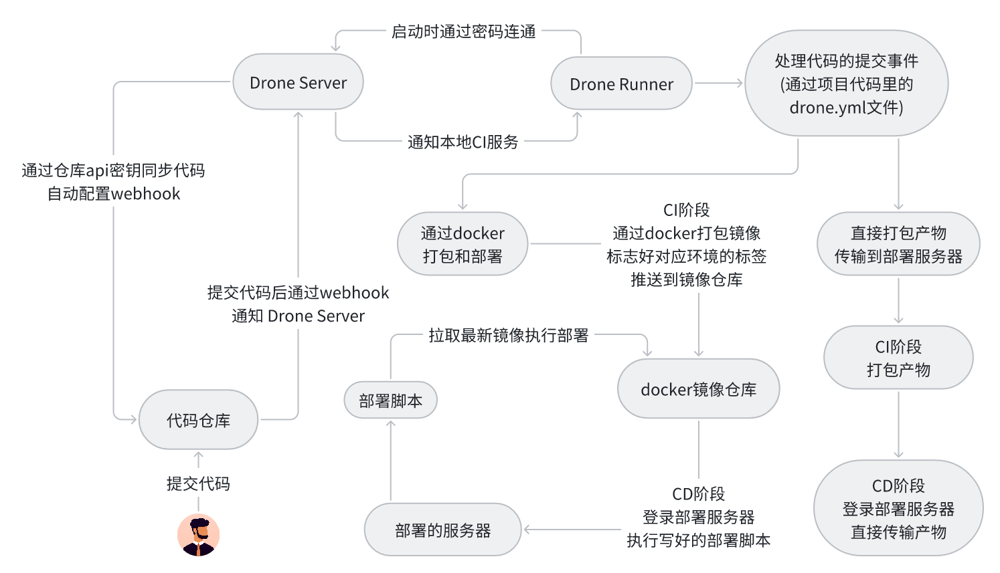
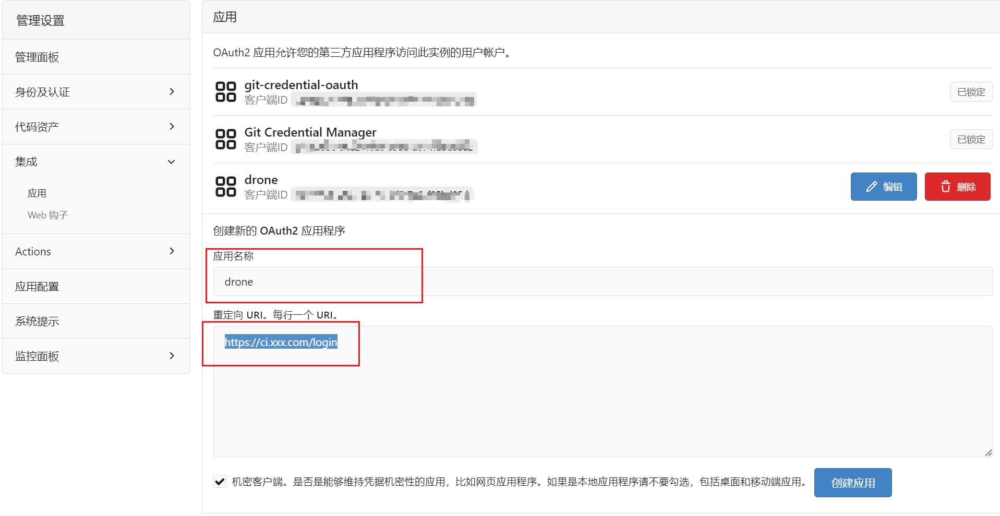
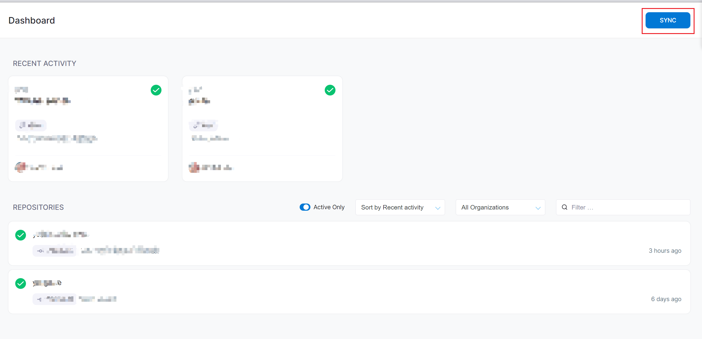
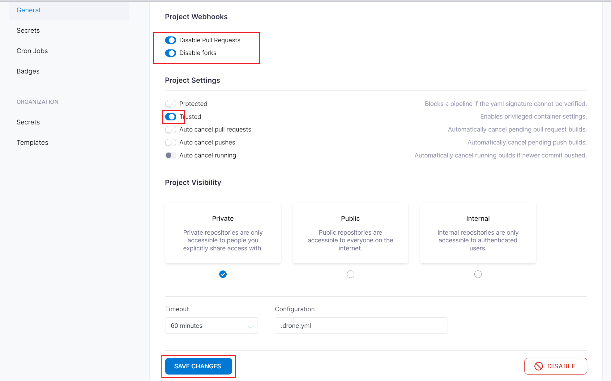
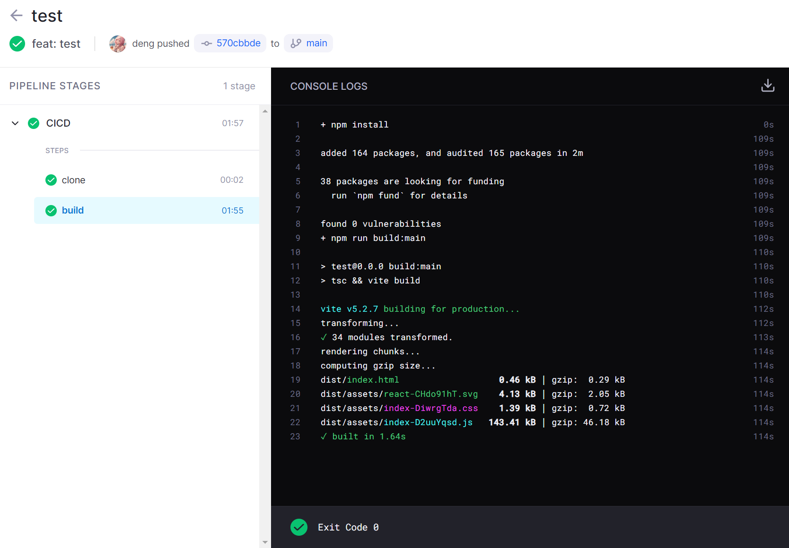
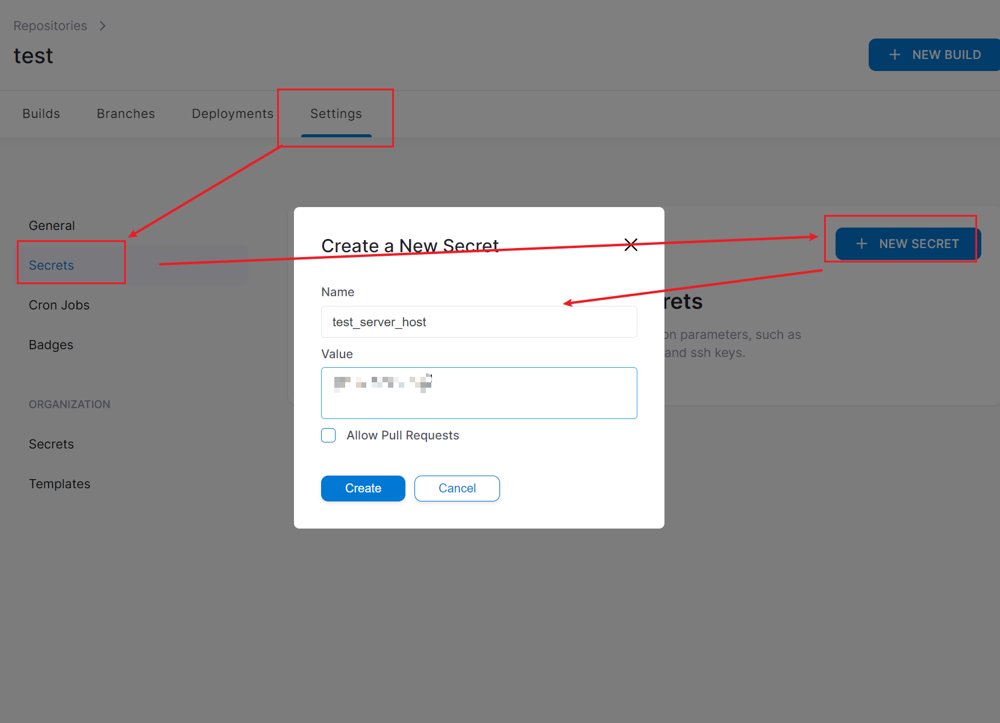
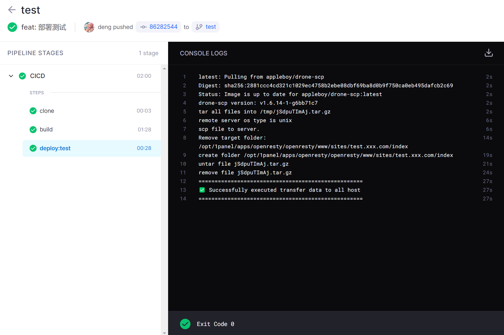
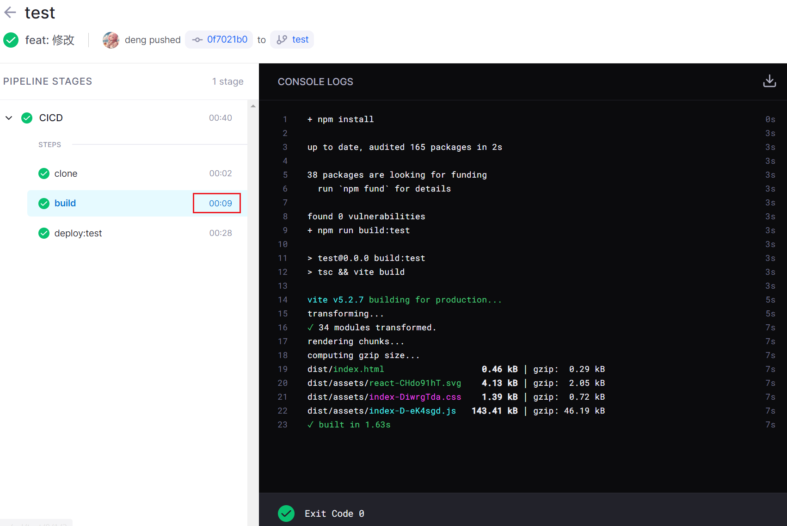
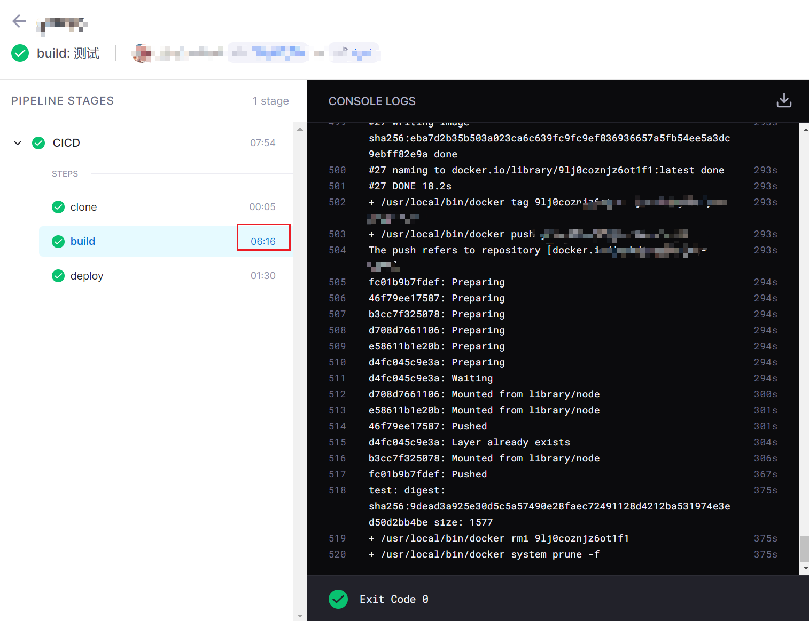
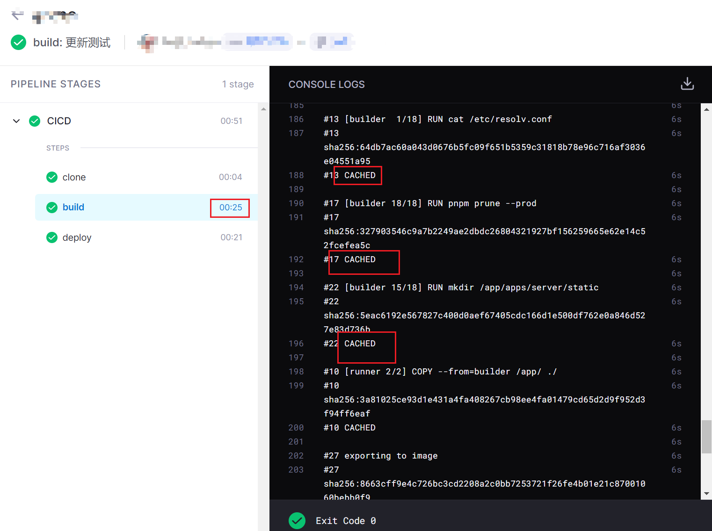

# 记录一次搭建持续集成持续部署的工程实践

本篇文章将记录使用 Gitea + Drone 实现一个持续集成持续部署(CI/CD)工作流的主要流程。Gitea + Drone 是非常流行的轻量级 DevOps 组合，这个组合的优势是全部自托管、资源占用低、配置简单，适合个人开发者和小团队替代 GitHub Actions 或 GitLab CI。

## Gitea 介绍

Gitea 是一个轻量级、开源、自托管的 Git 代码托管平台，用 Go 语言编写，可以完全基于容器部署。相当于简化版的 GitHub/GitLab，适合个人开发者、小团队或需要在私有服务器上管理代码的场景。

## Drone 介绍

Drone 是一个使用 Go 语言编写的轻量级CI/CD平台，和 Gitea 一样可以完全基于容器部署，轻松扩展流水线规模。开发者只需要将持续集成过程通过简单的 YAML 语法写入 Gitea 仓库目录下的描述文件 `.drone.yml` 就可以完成 CI/CD 配置。它的核心拆成以下两个部分：

### Drone Server

负责调度和管理。对接 Git 仓库监听代码变更，解析 `.drone.yml` 配置，把构建任务派发给 Runner，同时提供 Web 界面和 API 供人查看状态。它不直接执行构建，只负责安排工作和存结果。

### Drone Runner

负责实际执行构建。接收 Server 分发的任务，启动 Docker 容器（或其他环境）来运行编译、测试、部署等命令，实时回传日志，完成后上报结果。它是真正消耗计算资源的部分。

## CI/CD 整体流程架构图



一个 Server 可以带多个 Runner，构建压力大就加 Runner 机器。Server 和 Runner 可以跑在不同架构或系统上，互不影响。Server 很轻量，重活全由 Runner 扛。

由于 CI/CD 任务的特殊性，工作繁忙时会占用较多的系统资源，因此为了提高系统整体可靠性，不建议将代码仓库、Drone Server、Drone Runner 安装在同一台服务器上的，在我的这次实践中，我是将代码仓库和 Drone Server 同时运行在一台服务器上，Drone Runner 则运行在一台本地机器上。

## 准备工作

### Gitea

#### 安装

首先要安装好 Gitea 代码仓库，可以查看这篇的地址 [Gitea安装](/docker/images/gitea)。

#### 创建 OAuth2 应用程序

登录 Gitea 的超级管理员账号，进入 `管理后台` - `集成` - `应用`，创建一个 Gitea OAuth2 应用程序。

- 应用名称

  可以任取一个名字，此案例中填写 drone

- 重定向 URL

  授权回调 URL 形如 `http(s)://<YOUR_DRONE_SERVER>:<PORT>/login`，必须使用设定的 Drone 服务器协议和主机地址。如果使用非标准的 HTTP(S)端口，还应该指定准确的端口。



在添加后把客户端 ID 和客户端秘钥记录下来，下一篇在安装好 drone 时用来作为连接凭证。

### Drone

#### 安装 Drone Server

直接在服务器上通过 docker 启动 Drone Server。

`docker-compose.yml` 文件示例:

```yml
version: '3'

services:
  drone:
    image: drone/drone:2
    container_name: drone-server
    volumes:
      - /data/drone:/data
    restart: always
    ports:
      - 1688:80
    environment:
      - DRONE_GITEA_SERVER={Gitea的URL地址}
      - DRONE_GITEA_CLIENT_ID={Gitea客户端ID}
      - DRONE_GITEA_CLIENT_SECRET={Gitea客户端秘钥}
      - DRONE_RPC_SECRET={与drone runner通信的秘钥}
      - DRONE_SERVER_HOST={drone server的url地址}
      - DRONE_SERVER_PROTO=http
      - DRONE_TLS_AUTOCERT=false
      - DRONE_USER_CREATE=username:{Gitea的超管用户名},admin:true
```

- DRONE_GITEA_CLIENT_ID Gitea OAuth 客户端 ID
- DRONE_GITEA_CLIENT_SECRET Gitea OAuth 客户端密钥
- DRONE_GITEA_SERVER Gitea 服务器地址，例如 `http://git.xxx.com`。注意填写准确的 http(s) 协议，否则您会看到来自 Gitea 的错误报告：unsupported protocol scheme。
- DRONE_RPC_SECRET 共享密钥。这个密钥用于验证 Drone Server 和 Runner 之间的 RPC 连接。因此，在 Server 和 Runner 上都必须使用相同的密钥。
- DRONE_SERVER_HOST 您访问 Drone 时所用的域名或 IP 地址。如果使用 IP 地址，还应该包含端口。 例如 `http://ci.xxx.com`。
- DRONE_SERVER_PROTO 设置服务器的协议，使用：http 或 https。 如果您已经配置 ssl 或 acme，此字段默认为 https。
- DRONE_USER_CREATE 指定某个用户为管理员，例如：`username:john,admin:true`。参考文档 [Administrators](https://docs.drone.io/server/user/admin/)，管理员有权管理其他帐户、编辑仓库库详细信息、编辑仓库信任标志、访问受限制的 API。

#### 安装 Drone Runner

在准备用来跑 CI 的本地机器安装 Drone Runner。

`docker-compose.yml` 文件示例

```yml
version: '3'

services:
  drone-runner:
    image: drone/drone-runner-docker:1
    container_name: drone-runner
    restart: always
    ports:
      - 3222:3000
    volumes:
      - /var/run/docker.sock:/var/run/docker.sock
    environment:
      - DRONE_RPC_PROTO=http
      - DRONE_RPC_HOST={drone server的url地址}
      - DRONE_RPC_SECRET={与drone server通信的秘钥}
      - DRONE_LIMIT_TRUSTED=false
      - DRONE_RUNNER_CAPACITY=2
      - DRONE_RUNNER_NAME=drone-cli
```

- DRONE_RPC_HOST 填写 Drone Server 的主机名（以及可选填的端口号）。基于 PRC 协议连接 Runner 与 Server，接收流水线任务。
- DRONE_RPC_PROTO 传输协议：http 或 https
- DRONE_RPC_SECRET 与 Drone Server 共享的密钥
- DRONE_RUNNER_CAPACITY Runner 可以并发执行的流水线数量，默认：2
- DRONE_RUNNER_NAME 自定义 Runner 名称

检查 Drone Runner 是否和 Drone Server 连通。

```bash
docker logs drone-runner
```

显示下方内容即表示连接成功。

```bash
starting the server
successfully pinged the remote server
```

此时可以登录 Drone 网页面板，例如 `http://ci.xxx.com`，点击 continue 跳转到 Gitea 授权页面，点击应用授权，然后填写一下注册信息即可登录上去了。

## 实践自动化部署纯前端项目

### 项目创建

打开代码仓库，创建好一个项目，然后创建一个简单的前端项目，最后推送到Gitea代码仓库。

这时候在 drone 服务里是看不到这个项目的，需要点击一下 `sync` 同步一下。



### 激活仓库

同步好后仓库列表会出现刚刚新增的项目，点击进入我们需要进行 CICD 流程的仓库，点击 `Settings` --> `ACTIVATE REPOSITORY`，然后可以看到提示激活成功，并且 `Settings` 页面会出现很多选项，按如下配置即可。



这里要把`Trusted`配置上，后面[添加打包缓存](#添加打包缓存)会用到。

### CI 操作

在项目的根目录下添加一份`.drone.yml`文件。

```yml
kind: pipeline
type: docker
name: CICD

steps:
  - name: build
    image: node:18-alpine
    commands:
      - npm install
      - npm run build:${DRONE_BRANCH}

trigger:
  branch:
    - test
    - main
  event:
    - push
```

现在基于 docker 的 pipeline，我们定义了一个打包的 `step`，基于 `node:18-alpine` 镜像去打下载并打包我们的项目，`${DRONE_BRANCH}`是流水线触发时的分支，我们可以用这个去区分执行不同的打包操作。

`trigger` 配置那里表示，我们要在 test 和 main 分支被 push 代码时，才会执行我们的 pipeline。

写好后此时可以把代码推送到Gitea代码仓库简单地测试一下。

此时可以在 drone server 上看到仓库的`Builds`选项里多了一个`EXECUTIONS`，点击进去，可以看到 runner 正在运行流水线。



### CD 操作

前端项目的部署，我们只需要把打包出来的产物直接上传到服务器环境即可，可以基于 `appleboy/drone-scp` 这个 drone 插件去传输文件，在 `.drone.yml` 文件中添加一个新的 `step`。

```yml
# ...
steps:
  - name: build
    # ...
  - name: deploy:test
    image: appleboy/drone-scp
    depends_on: [build]
    settings:
      host:
        from_secret: test_server_host
      username:
        from_secret: test_server_username
      key:
        from_secret: test_server_key
      port:
        from_secret: test_server_port
      source: ./dist/*
      target: /opt/1panel/apps/openresty/openresty/www/sites/test.xxx.com/index
      strip_components: 1
      rm: true
    when:
      branch: test
# ...
```

`settings` 里的配置是需要传给 `appleboy/drone-scp` 镜像使用的，`source` 填写本地打包好的要传输的文件，`target` 填写服务中的文件夹路径，这里执行时会自动登录服务器并把打包后`dist`里的文件都传输到指定的`target`文件，还有`strip_components`、 `rm`等参数，具体这里的参数都有些什么作用，去查看 [drone-scp 文档](https://plugins.drone.io/plugins/scp) 即可。

配置里的 `when.branch` 可以看到指定了`test`，这表明这个部署操作只有是 test 分支的代码提交了才会触发，这样就可以区分不同的环境去部署了。

### 密钥配置

配置里的 `host`、`username`、`key`、 `port` 这里登录服务器需要用到的敏感数据都用了 `from_secret` 去读取，这里敏感数据不能直接明文写在`.drone.yml`文件中，除非只有自己一个人维护这个项目，所以需要使用 `from_secret` 从 Drone server 去读取配置好的字符串，接下来去配置一下。

点击 `Settings` --> `Secrets` --> `NEW SECRET`。



依次配置好对应的 4 个变量后，把代码提交到 test 分支，然后推送到代码仓库测试一下。



可以看到没有报错即可，自行检查你对应的服务是否更新，这里的`target`文件夹在我的服务已经添加好 nginx 的代理了，只要文件更新，那么重新访问就会生效。

### 添加打包缓存

这个时候你会发现有个问题，打包的操作是在一个 docker 容器里面进行，这样每次进行任何更新都要重新下载 `node_modules` 依赖，太浪费资源了。

接下来通过添加宿主机的挂载卷去解决这个问题。

```yml
# ...
# 声明宿主机 映射到 drone 执行器的数据卷
volumes:
  - name: node_modules # 数据卷名称
    host:
      path: /home/drone/test/cache/node_modules # 宿主机的绝对路径

steps:
  - name: build
    image: node:18-alpine
    volumes:
      - name: node_modules # 数据卷名称
        path: /drone/src/node_modules # 容器内的绝对路径
    commands:
      - npm install
      - npm run build:${DRONE_BRANCH}
# ...
```

Drone runner 使用 `volumes` 是需要这个项目配置好权限的，这就是前面配置了 `Trusted` 的作用，否则 build 时运行时会报 `untrusted repositories cannot mount host volumes` 的错。

直接提交代码打包一次，这一次你会看到打包的时间并没有减少，因为这是第一次挂载`volumes`，下一次打包就有 `node_modules` 的缓存了，随便提交点代码再测试一下。



可以看到时间只用了 9s，比之前减少很多了。

## 实践自动化部署 docker 容器

这里需自行写好一个项目，并在里面编写好自己的 `Dockerfile` 文件用于打包镜像，请先在本地测试打包好的镜像可以使用。

### CI 操作

drone 有一个官方插件镜像[plugins/docker](https://plugins.drone.io/plugins/docker)，它支持打包 docker 镜像并顺便传输到对应的镜像仓库，接下来开始编写 `.drone.yml` 文件把它加上。

```yml
kind: pipeline
type: docker
name: CICD

steps:
  - name: build
    image: plugins/docker
    settings:
      username:
        from_secret: docker_username
      password:
        from_secret: docker_password
      repo: xxx/test-project
      dockerfile: Dockerfile
      build_args:
        - BRANCH=${DRONE_BRANCH}
      tags:
        - ${DRONE_BRANCH}
trigger:
  branch:
    - test
    - main
  event:
    - push
```

配置特别简单，通过 `username` 和 `password` 指定了从密钥读取的用户名和密码(这个需在Drone server配置，请看[密钥配置](#密钥配置))，再通过 `repo` 定义一个仓库名，到时镜像打包完成就会自动推送到 docker 官方的镜像仓库，`dockerfile` 指定根目录的 Dockerfile，tags 直接指定成 `${DRONE_BRANCH}`，这个参数可以获取当前触发的分支，我要以这个作为镜像的标签，配置 `build_args` 相当于配置 `docker build --build-arg`，我的 dockerfile 里需要一个`BRANCH`的`ARG`变量，所以这里也加上了。

如果还需要自定义更多功能，如推送到私人的镜像仓库，具体更多的用法可以自行前往[文档](https://plugins.drone.io/plugins/docker)查看。

### CD 操作

接下来的 CD 操作按照之前写的架构图，是需要登录到部署服务器进行的，drone 里也有一个插件[appleboy/drone-ssh](https://plugins.drone.io/plugins/ssh)实现了这个功能。

```yml
# ...
steps:
  - name: build
  # ...
  - name: deploy:test
    image: appleboy/drone-ssh
    depends_on: [build]
    settings:
      host:
        from_secret: test_server_host
      user:
        from_secret: test_server_username
      key:
        from_secret: test_server_key
      port:
        from_secret: test_server_port
      command_timeout: 2m
      script:
        - echo ====开始部署=======
        - cd /deploy/test
        - docker pull xxx/test-project:test
        - docker compose -p test-project down
        - docker compose up -d
        - docker rmi $(docker images -f dangling=true -q)
        - echo ====部署成功=======
    when:
      branch: test
# ...
```

可以看到配置也是特别简单，设置好要登录服务器的登录信息后，在`script`里逐行添加脚本，我这里是先去到`/deploy/test`这个目录，服务器里这个目录下面提前写好了一个`docker-compose.yml`文件，所以脚本只需拉取一下最新的镜像并把旧的容器停止，最后重新启动一下，顺便把无效的旧镜像删除即可。

文件写好后直接测试一下。



### 添加 docker 打包的缓存

这个时候还有一个问题，`plugins/docker`打包镜像时，是使用一个临时容器内的 docker 去打包的，并不是使用宿主机的 docker，这样打包镜像时都会没有之前构建时缓存的层而导致完全重新构建，如上图的话，也就是会花个 6 分中，这样浪费太多资源了。

接下来可以通过把容器内的`/var/run/docker.sock`映射为宿主机的`/var/run/docker.sock`去解决这个问题，因为 docker 的打包命令其实是 docker client 向`/var/run/docker.sock`这个文件通知 docker server 去打包的，这样相当于容器内调用打包命令时，其实是在通知宿主机的 docker server 去打包镜像，宿主机是会有缓存的。

```yml
# ...
volumes:
  - name: docker # 数据卷名称
    host:
      path: /var/run/docker.sock # 宿主机的绝对路径
steps:
  - name: build
    image: plugins/docker
    volumes:
      - name: docker # 数据卷名称
        path: /var/run/docker.sock # 容器内的绝对路径
    settings:
      # ...
# ...
```

最终测试一下。



可以看到时间少了很多，docker没有变动的层都有上一次构建的缓存。
