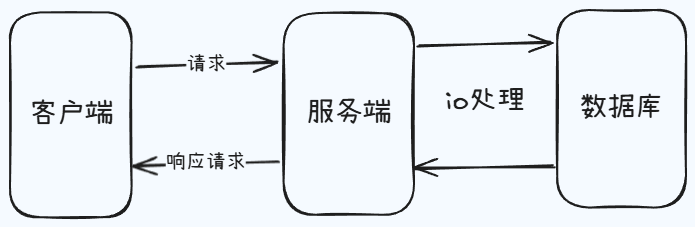
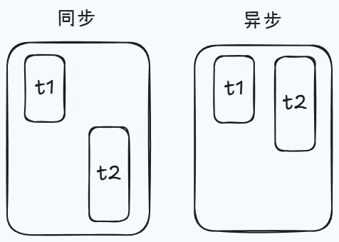
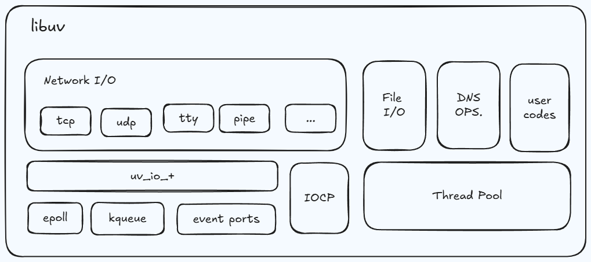
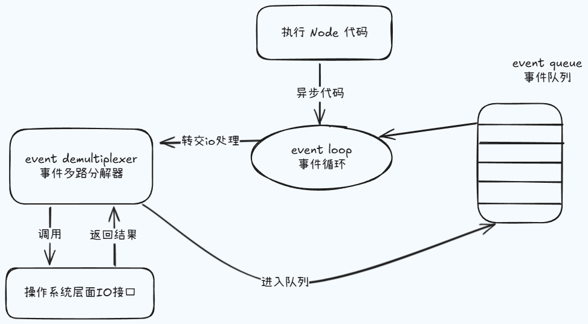

# 异步 IO

## 为什么说 nodejs 性能好

nodejs 在诞生之初是为了实现高性能的 web 服务器，后来经历了长时间的发展之后，nodejs 也就慢慢的演化成了可用的服务端“语言”，那这样也就让 javascript 实现了在浏览器之外的平台去进行工作的场景。此处我使用了一个并不严谨的说法，我把 nodejs 叫做语言，但前提是我们都明白它是一个平台，或者说运行时，只是对于前端来说，我们可以直接去使用 js 在 nodejs 环境下去进行编程，而为了后续的内容描述方便，我这里就此约定不再纠结了。

接下来就来分析一下，为什么在众多的实现方案当中，nodejs 是最出彩的那一个。以 bs 架构为基础来说，用户去发送请求到获取数据的整个过程，首先用户去通过客户端向服务端发送请求来获取目标数据，而服务端只需要在接收到请求之后，依据业务逻辑去返回数据即可，对于这个过程当中，我们并不会去讨论过多的细节，那通过下面的图示，我们就不难发现，在我们忽略掉网络带宽，硬件性能等这样的一些客观条件之后，我们真正去影响用户获取数据速度的，其实也就是 IO 的时间消耗。

而我们也都知道 IO 绝对是计算机操作过程中最缓慢的一个环节，访问 ram 这样一个级别设备的 IO 时间消耗是为纳秒级别的，而在磁盘和网络中访问数据的时间消耗，它的量级是毫秒级别的，那也就是说数据的读写操作终归是要有时间消耗的，那假设当前是一个串行的模式，那么对于一个服务器来说，如果当前正在处理的请求当中，它包含了一个需要长时间等待的 IO 行为，那么后续的任务就不能够去得到及时的响应了，很显然这是很不友好的，而且我们当下在开发过程中去使用到的一些服务器，它也都具备了并发处理事务的能力，那么在并发的实现上，传统的做法或者说其他高级编程语言实现的方式，其实就采用多线程或者说多进程的方式，但是这样的解决思路，在某些场景下肯定也是会有一些问题的。

那我们这里就使用餐馆服务的例子来进行说明，如果说使用多线程来处理这样的一个并发问题，那他的思路就是当有几个人来就餐，那么我们就会去准备几个服务员来完成相应的服务，那在这之后，客人就去进行点菜，然后服务员就等待这个点菜的结果，那对应到我们的程序里边，就是当前有几个请求从客户端发送到我们的服务端之后，我们的服务端就会去准备几个进程，或者说几个线程来接收这些请求，那这样的服务对于用户的体验来说，是非常友好的，但问题也会很明显，如果某个时间内同时有很多人来进行就餐，而我们是不可能无限的去增加服务员的数量的，那这样无人响应的问题也就出现了。

而分析点餐的过程之后，我们就可以发现，其实大部分的时间消耗都来自于客人点菜，这样的一个行为的等待过程中，而在这个时候，服务员其实是处于空闲状态的，所以基于这种情况，那也就有了 reactor 这样的一个模式，也被叫做应答者模式，它的核心思想其实就是只保留一个服务员，然后客人自己去进行点餐，而当这个客人点餐行为结束之后，他只需要去呼叫当前的服务员就可以了，那这样的话我们就相当于是使用了单线程，而完成了之前多线程才能实现的事情，并且它是非阻塞的，也就是说每个客人进来之后，我们都会有一个服务员能够去立马的给他一个响应，只不过在他点餐的过程中，我们这个服务员可能正在服务于其他的客人，那使用这样的操作，也就可以去避免多个线程之间在进行上下文切换的时候，需要去考虑的一些状态保存，时间消耗以及状态锁等这样的一些问题。

而 nodejs 也正是基于了 reactor 模式，然后再结合 js 语言本身它所具备的一些单线程、事件驱动的架构和异步编程这样的一些特性，然后让我们这样的一个单线程是可以远离阻塞，从而通过异步非阻塞的 IO 来更好的去使用 cpu 资源，并且去实现高并发请求的处理，那这也是为什么，历史上尝试着将 js 是移植到其他平台的实现方案，其实有很多的，而 nodejs 却是最后最出彩的那一个。

那最后还要再说明一点，上述内容当中，我们一直在突出的是 nodejs 在处理 IO 时所具备的优点，那这也就意味着在非 IO 行为的时候，它其实也会有一些不适用的地方，那比如说我们当前点餐的客人，他如果都不需要去花时间来思考我们要吃什么，而是立即进行点餐，那么这个时候一个服务员显然是不够用的，那这样对应到我们的程序里，也就是所谓的 cpu 密集型，所以对于 nodejs 的使用来说，我们更多的是用它去处理 IO 密集型的高并发请求，而并不是大量且复杂的业务逻辑处理，但是这些也并不影响我们将 nodejs 应用于同构开发和前端工程化当中，它仍然是大前端的一个基石。

那下面就简单的分析一下，在编码的过程中，我们为什么需要去使用到异步 IO，它能够去给我们带来什么样的好处，那如图所示，假设当前是有两个 IO 任务的，而且现在是一个单线程的，那这个时候俩任务单独去执行的时候，分别会耗时 t1 和 t2，如果现在采用同步的方式来完成，那么总时间 t 应该是大于 t1 和 t2 的和，这个道理也很简单，因为我们 t2 的执行要等到我们 t1 的结果产出之后才会发生，而如果说我们现在采用的是异步的方式来执行的话，那总时间的消耗肯定是小于 t1 和 t2 的和，或者说它干脆就是 t1 和 t2 当中时间较大的那个值。

异步 IO 的做法对于程序的执行效率来说是有帮助的，因此我们是需要它的，而异步 IO 也并非是 nodejs 的原创，但是他在 nodejs 中却拥有着广泛的应用。

## 实现

那我们在这里就来探讨一下 node 中它是如何实现的，不过在这之前，我们针对于 异步 IO 相关的一些理论，也先来去做一些说明。

其实对于操作系统来说，IO 只有阻塞和非阻塞这样的两种的，那也就是说我们当前是否能够去立即获取到调用之后所返回的结果，就像我们上文所提到的那样，当我们采用了非阻塞的 IO 之后，cpu 的时间片就可以被拿出来，然后去处理其他的事物，那这个时候对于性能肯定是有所提升的，但是这种操作也同样存在着一些问题，因为立即返回的并不是我们业务层真正期望得到的实际数据，而仅仅是当前的调用状态，那操作系统为了获取完整的数据，它就会让应用程序去重复的调用 IO 操作，从而来确认 IO 操作是否是已经完成了，那我们也将这种重复调用操作来判断 IO 是否完成的技术去叫做轮询。

常见的一些轮询技术有 read、select、epoll、kqueue、event ports 等等这些，那其中 event ports 就是 linux 下的，而 kqueue 就是 free bsd 系统下的，虽然轮询技术能够去确定 IO 是否完成，然后将获取的 IO 完成之后产出的数据再返回回去，但是对于代码而言，它还是同步的效果，因为在轮询的过程中，程序仍然是在等待着 IO 的结果，所以我们期望的 IO 应该是代码可以直接去发起非阻塞的调用，但是他也无需去通过遍历或者说唤醒的方式来轮询的判断当前的 IO 是否结束了，而是可以在调用发起之后，直接去进行下一个任务的处理，然后等待 IO 的结果处理完成之后，那么再去通过某种信号或者说回调的方式，将数据再传回给当前的代码进行使用就可以了，那这个时候 node 核心当中的 libuv 库就该出场了，我们可以去把这个 libuv 库去看作是几种不同的异步 IO 实现方式的抽象封装层。

例如我们现在从这个图里边可以看到的，在类 unix 系统下有 epoll 接口，centos 的 event ports，windows 下有 IOCP 等，当我们运行了一段 nodejs 编写的代码之后，最终是会走到 libuv 库这个环境里来的，而他就可以去对当前的平台进行判断，然后在依据平台调用相应的异步 IO 处理的方法。

了解了操作系统对于 IO 的支持之后，我们就来看一下 nodejs 当中具体实现异步 IO 的过程，这个时候我们就绕不开 nodejs 环境下的事件循环了，但它并不是我们当前探讨的具体内容，而且事件循环过程中，同样也存在着许多的内容是值得单独来进行说明的，因此这里我们就先去从 nodejs 代码执行的周期角度来进行介绍异步 IO 的实现。

如上图所示，当我们执行一个 nodejs 脚本时（在这里先去省略掉 v8 的工作，我们认为代码是可以直接去运行的），并且我们编写的代码当中如果存在着异步的请求，那 libuv 就会去工作，此时它会对相应的异步请求处理程序去进行管理，我们这里还是以 IO 操作为例来进行说明，当前我们要处理的如果是网络 IO，则就会去调用相应的操作系统底层的 IO 接口来进行处理，那如果说我们代码里面的 IO 是一个文件 IO，那这个时候就会被放入到我们 nodejs 执行实现的这样一个线程池当中，然后去进行处理，但是不论是哪一种处理方式，最终它都会有一个返回的结果，这个结果在出来之后就会去通过 event loop，也就是事件循环，去把它对应的回调函数，或者说处理程序加入到这个具体的事件队列当中，然后就等待着 js 的主线程来进行执行。而这个循环它也并非是一直运转不停的，当他发现队列当中完全没有了需要等待执行的任务时，他也就会去退出循环，那当前程序的执行也就算是结束了，而对于 nodejs 来说，它的 异步 IO 操作也就算是完成了。

## 总结

那上面这些内容就包含了 nodejs 的 异步 IO 实现的理论过程，那在这里边我们也去做一下总结。

- IO 是应用程序的瓶颈所在
- 异步 IO 提高性能无需原地等待结果返回
- IO 操作属于操作系统级别，平台都有对应实现
- Nodejs 单线程配合事件驱动架构及 libuv 实现了异步 IO

第一， IO 可以看作是任何应用的瓶颈所在，因为它的处理是肯定要消耗时间的，而这个时间是跟我们的设备或者说客观的条件是有很大关系的。

第二，采用了异步 IO 的方式之后，是可以提高性能的，因为我们无需在原地等待某个结构的返回，而可以接着去处理其他的任务，那这样我们 cpu 的利用率就会变高了。

第三， IO 操作的本身在当前操作系统级别，其实也都是有对应解决的，而我们的 libnv 库，其实就相当于是对这些方法进行了一个抽象的封装，那做到了一个跨平台的效果。

第四， node 配合的 js 的单线程，以及事件驱动和 libuv 库等这样的一些特点，那就很好的去实现了异步 IO，那这样的话我们就不需要等待着异步操作结果返回，可以继续去往下执行我们的 js 代码，而当异步的事件触发完成之后，就会去通知主线程，然后自然是主线程就会来去执行我们相应的事件回调。
