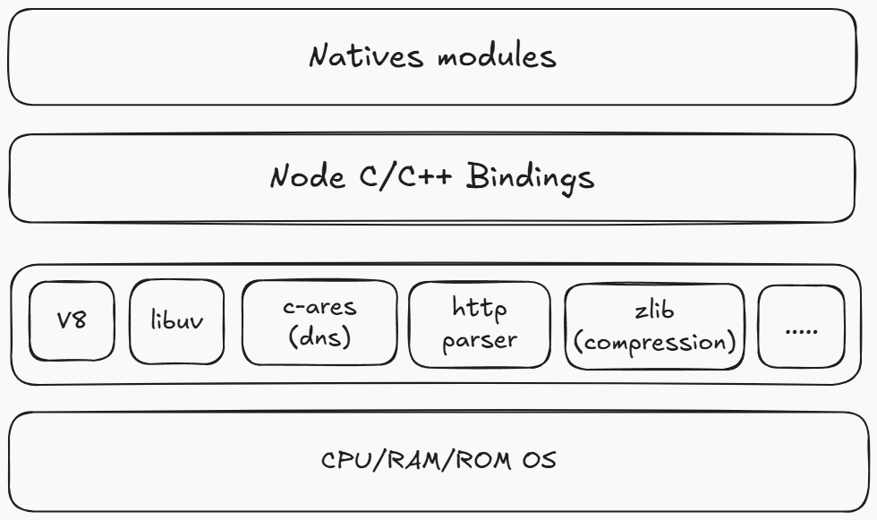

# 介绍与架构

nodejs 并不是 JavaScript 应用，也不是编程语言，我们会认为它是由其提供的核心 api 再加上 ECMAScript 来组成的，因为编程语言使用的是 JavaScript，所以 nodejs 是 JavaScript 的运行时，它只是一个平台，而这个平台就扩展了在 web 上 JavaScript 不能实现的功能。

nodejs 是构建在 v8 引擎之上的，v8 引擎是由 C/C++编写的，因此我们的 JavaSCript 代码需要由 C/C++转化后再执行。

nodejs 使用异步 I/O 和事件驱动的设计理念，可以高效地处理大量并发请求，提供了非阻塞式 I/O 接口和事件循环机制，使得开发人员可以编写高性能、可扩展的应用程序，异步 I/O 最终都是由 libuv 库去实现的。

nodejs 使用 npm 作为包管理工具类似于 python 的 pip，或者是 java 的 Maven，目前 npm 拥有上百万个模块。[www.npmjs.com](https://www.npmjs.com)

由于 nodejs 的 IO 依靠 libuv ，所以干一些 IO 密集型应用有很强的处理能力，因为 nodejs 单线程原因，所以不适合 CPU 密集型应用，容易造成 CPU 占用率高，如果非要做 CPU 密集型应用，可以使用 C++ 插件编写 或者 nodejs 提供的 cluster。(CPU 密集型指的是图像的处理或者音频处理需要大量数据结构 + 算法)

## 架构图

## Natives modules

native modules 里边的内容，都是由 js 来进行实现的，它提供了我们许多当前应用程序是可以直接去进行调用的库，其实也就是我们日常所说的内置核心模块，如 fs、path、http 等等模块，但是我们也都知道，js 语言编写的程序是无法直接来操作硬件设备的，因此 nodejs 核心模块与硬件设备之间，如果想要通信是还需要有一个桥梁的，这个桥梁就是下面的 Builtin modules (胶水层)。

## Builtin modules

通过这个桥梁，我们就可以让 nodejs 的核心模块来获取到具体的服务支持，从而去完成更底层的操作，例如文件的读写行为，那在上图中我们就使用 Node C/C++ Bindings 来进行表示。当然在这一层当中，除了内置的模块之外，是还有很多第三方的模块来充当桥梁的，而我们只是需要去了解在这一层当中，它里边的内容主要是由 C++ 的代码来进行编写而成的，例如 socket、http 这样的一些基础功能，关于这一点，我们还要再去强调一下，在这一层当中的 http、socket 等我们所提到的这些功能模块，它们并不是真正代码级别上的功能实现，它们更像是一个功能调用的对照表，这就好比是我们要在 js 层去调用一个 a 功能，但是这个 a 功能的最终实现的是通过 C/C++ 加加语言来实现的，而且这个实现之后的内容又被放在了另外一个地方，这个时候我们就需要有人来帮助我们，真正的去找到这个 a 功能的实现，那此时 Builtin modules 就起到了帮助我们去调用具体的 c++ 函数的作用。

## 底层库

再往图下边去看一下，下一层的主要内容就是 v8、libuv 库和一些具体的功能模块。

其中 v8 这个引擎主要的功能是有两个，第一个功能就类似于我们之前所了解的虚拟机，主要来负责完成 js 代码的执行，这里要被执行的代码一般会分为三种情况，一个是我们自己编写的 js 代码、内置的 js 代码和第三方的 js 代码。

第二个功能就是提供桥梁接口，开发者在使用 node js 的时候，看起来我们在代码里边是直接调用了某个 js 函数，但是真正起效果的是由 C/C++ 编写的函数，而这个中间的转换和调用的具体实现，就是需要我们的 v8 引擎来赋能完成，说白了就是 js 与 C/C++ 之间的转换功能。

总的来说就是 v8 为 nodejs 提供了初始化的操作，他创建了执行上下文环境和作用域这些内容，有了 v8 之后，nodejs 就已经具备了执行和调用功能的大前提，而最终 nodejs 代码在执行的过程中还会存在着很多的细节，例如说事件循环，事件驱动和异步 io 等需要处理的问题，而这些就需要 libuv 来进行参与和实现了，那有了 v8 和 libuv 库之后，nodejs 的功能就已经非常的强大了。

那余下的就是一些具体的第三方功能模块，这些功能模块会去完成相对应的功能。
